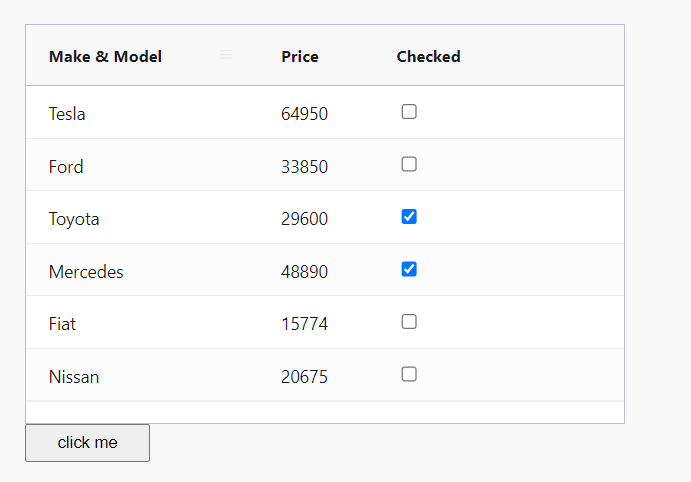

## Screenshot

## Reference
* https://www.ag-grid.com/react-data-grid/getting-started/
* https://primeflex.org/gridsystem

##
使用 useState 的時候定義表格變數 (如下) 的時候，
const [rowData, setRowData] = useState

我們一般會使用 const newData = rowData
對 newData 進行某些操作後，再使用setRowData(newData)
但這會導致一些奇怪的bug，會發現表格沒有進行 View Refresh
這因為 newData 與 rowData 是同一個參照，因此請使用 deep copy的方式再進行編輯

    const originalRowData = [...rowData];
    const copiedRowData = JSON.parse(JSON.stringify(originalRowData));
    

